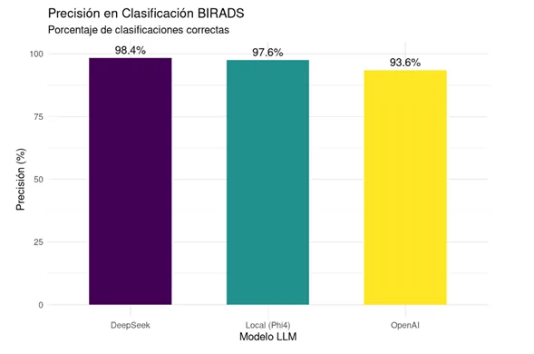

# Medical Notes Data Extraction with LLMs

This repository contains FastAPI applications that extract **structured information from medical notes** (CSV files) using Large Language Models (LLMs). It benchmarks several models — OpenAI, DeepSeek, and a locally hosted model (Phi-4 via Ollama) — for clinical information extraction from mammography reports.

- `app.py`: Uses the **OpenAI API** for text processing.
- `appd.py`: Uses **DeepSeek** for text processing.
- `local.py`: Uses a **locally hosted model** through Ollama (Phi-4).

<p align="center">
  
</p>

## Requirements

Before running any of the applications, make sure you have the dependencies installed.

Python 3.12 or higher with the following libraries:

```bash
pip install -r requirements.txt
```

If you use `local.py`, make sure **Ollama** is installed and running on your machine. You can download it from [Ollama](https://ollama.com/).

> To run Ollama with the Phi-4 model, use the following command:
```bash
ollama serve --model phi4
```

## Configuration

Create a `.env` file in the project root with the following variables:

```ini
# For app.py (requires an OpenAI API key)
OPENAI_API_KEY=your_api_key

# For local.py (requires a running Ollama server)
OLLAMA_API_URL=http://localhost:11434/api
```

## Usage

### 1. Run with OpenAI (`app.py`)

Start the FastAPI server with OpenAI:

```bash
uvicorn app:app --reload
```

This starts a server at `http://127.0.0.1:8000`.

### 2. Run with DeepSeek (`appd.py`)

Start the FastAPI server with DeepSeek:

```bash
uvicorn appd:app --reload
```

This starts a server at `http://127.0.0.1:8000`.

### 3. Run with Ollama (`local.py`)

To use the local Ollama Phi-4 model:

```bash
uvicorn local:app --reload
```

Make sure **Ollama is running** on your machine before executing this command.

## API Usage

All applications expose an endpoint to process CSV files:

```
POST /process-medical-csv/
```

**Parameters:**
- `file`: CSV file (must contain the columns `ID_DOCUMENTO`, `PRESTACION`, `EDAD_EN_FECHA_ESTUDIO`, `ESTUDIO`).
- `search_terms`: Key terms to search for within the medical notes.
> `search_terms` defaults to type `str`.

Example with `cURL`:

```bash
curl -X 'POST' \
  'http://127.0.0.1:8000/process-medical-csv/' \
  -H 'accept: application/json' \
  -H 'Content-Type: multipart/form-data' \
  -F 'file=@file.csv' \
  -F 'search_terms="nodules, calcifications"'
```

The result is a JSON object with the extracted data.

Example using `uvicorn local:app --reload`:

- The interactive interface is available at **127.0.0.1:8000/docs**:


- Select the **POST /process-medical-csv/** endpoint and click **Try out**:


- Upload the CSV file in the requested format and click **Execute**:


---

## Results

- **Overall accuracy (BIRADS):**
BIRADS classification is critical to determine the clinical management of mammographic findings:


The DeepSeek model shows the highest accuracy in BIRADS classification (98.42%), followed by Local (Phi-4) (97.56%) and OpenAI (93.56%).

- **Hallucination rate (lower is better):**
Hallucinations represent cases where the model generates incorrect information or content not present in the reference:


DeepSeek shows the lowest hallucination rate, followed by OpenAI and Local (Phi-4). These results indicate that the hallucination rate decreases as model size and complexity increase.

- **Per-field accuracy:**
We analyzed each model's accuracy in identifying specific radiological findings, comparing all fields available in the reports.

#### Accuracy comparison between LLMs on clinical report transcription

| **Clinical field**                          | **DeepSeek** | **OpenAI** | **Phi4** |
|---------------------------------------------|--------------|------------|----------|
| Nodules                                     | 81.36%       | 73.29%     | 33.37%   |
| Presence of microcalcifications             | 70.25%       | 77.59%     | 29.68%   |
| Typically benign calcifications             | 89.18%       | 74.91%     | 20.14%   |
| Suspicious-morphology calcifications        | 58.57%       | 52.58%     | 16.27%   |
| Calcification distribution                  | 81.80%       | 71.94%     | 28.93%   |
| Presence of asymmetries                     | 75.50%       | 79.25%     | 43.80%   |
| Asymmetry type                              | 70.25%       | 22.03%     | 3.04%    |
| Associated findings                         | 74.34%       | 67.19%     | 40.41%   |
| Finding laterality                          | 72.13%       | 63.55%     | 26.48%   |
| BIRADS                                      | 94.65%       | 92.56%     | 90.65%   |

- **Pricing:**
LLM pricing varies by provider and by the specific characteristics of each model. The prices for each model are shown below:


Additional candidate models are also included:


## Tech Stack

Python · FastAPI · OpenAI API · DeepSeek · Ollama (Phi-4) · Uvicorn

## Contact

If you have questions or suggestions, open an issue in this repository.
